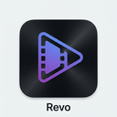

# Revo Video Editor

<div align="center">



**A professional desktop video editor built with Tauri, React, and FFmpeg**

[](https://tauri.app/)
[](https://react.dev/)
[](https://www.typescriptlang.org/)
[](https://www.rust-lang.org/)

</div>

---

## 🎬 About

Revo is a modern, cross-platform desktop video editor that combines the power of Rust with the flexibility of web technologies. Built on the Tauri framework, it offers native performance with a beautiful, intuitive interface.

### ✨ Key Features

- 🎞️ **Timeline-Based Editing** - Intuitive timeline interface with drag-and-drop support
- 📝 **Text Overlays** - Add and customize text layers with full control
- 🎨 **Layer Management** - Organize multiple video, image, and text layers
- 🎥 **Real-Time Preview** - See your edits instantly with canvas-based rendering
- 💾 **Client-Side Export** - Process videos locally using FFmpeg.wasm
- 🌙 **Premium Dark UI** - Professional, eye-friendly interface optimized for video editing
- ⚡ **Native Performance** - Rust backend for maximum speed and efficiency
- 🔒 **Privacy-First** - All processing happens on your machine

---

## 🛠️ Tech Stack

### Backend
- **Tauri** - Desktop application framework
- **Rust** - Systems programming language for the backend

### Frontend
- **React** - UI component library
- **TypeScript** - Type-safe JavaScript
- **Vite** - Fast build tool and dev server
- **Zustand** - Lightweight state management
- **Fabric.js** - Canvas manipulation library
- **FFmpeg.wasm** - Browser-based video processing

---

## 📋 Prerequisites

Before you begin, ensure you have the following installed:

- **Node.js** (v18 or higher)
- **npm** or **yarn**
- **Rust** (latest stable version)
- **Cargo** (comes with Rust)

### Platform-Specific Requirements

#### Linux
```bash
sudo apt update
sudo apt install libwebkit2gtk-4.0-dev \
    build-essential \
    curl \
    wget \
    file \
    libssl-dev \
    libgtk-3-dev \
    libayatana-appindicator3-dev \
    librsvg2-dev
```

#### macOS
```bash
xcode-select --install
```

#### Windows
- Install [Microsoft Visual Studio C++ Build Tools](https://visualstudio.microsoft.com/visual-cpp-build-tools/)
- Install [WebView2](https://developer.microsoft.com/en-us/microsoft-edge/webview2/)

---

## 🚀 Getting Started

### Installation

1. **Clone the repository**
   ```bash
   git clone https://github.com/yourusername/revo-video-editor.git
   cd revo-video-editor
   ```

2. **Install dependencies**
   ```bash
   npm install
   ```

3. **Run in development mode**
   ```bash
   npm run tauri:dev
   ```

   This will:
   - Start the Vite dev server
   - Compile the Rust backend
   - Launch the Tauri desktop window
   - Enable hot module replacement

### Building for Production

```bash
npm run tauri:build
```

This creates distributable packages in `src-tauri/target/release/bundle/`:
- **Linux**: `.deb`, `.AppImage`
- **macOS**: `.app`, `.dmg`
- **Windows**: `.msi`, `.exe`

---

## 📁 Project Structure

```
Revo/
├── src/                      # React frontend source
│   ├── components/           # React components
│   │   ├── VideoCanvas.tsx   # Canvas rendering
│   │   ├── Timeline.tsx      # Timeline UI
│   │   ├── LayerPanel.tsx    # Layer management
│   │   ├── Toolbar.tsx       # Main toolbar
│   │   └── ExportDialog.tsx  # Export settings
│   ├── store/
│   │   └── videoStore.ts     # Zustand state management
│   ├── types/
│   │   └── index.ts          # TypeScript definitions
│   ├── utils/
│   │   ├── ffmpeg.ts         # FFmpeg integration
│   │   └── videoUtils.ts     # Helper functions
│   ├── App.tsx               # Main app component
│   ├── main.tsx              # React entry point
│   ├── index.css             # Global styles
│   └── App.css               # Component styles
├── src-tauri/                # Rust backend
│   ├── src/
│   │   ├── main.rs           # Tauri app entry
│   │   └── commands.rs       # Backend commands
│   ├── icons/                # App icons
│   ├── Cargo.toml            # Rust dependencies
│   └── tauri.conf.json       # Tauri configuration
├── index.html                # HTML template
├── package.json              # npm dependencies
├── tsconfig.json             # TypeScript config
├── vite.config.ts            # Vite config
└── README.md                 # This file
```

---

## 💡 Usage

### Importing Videos

1. Click the **"Import Video"** button in the toolbar
2. Select a video file from your system (MP4, AVI, MOV, MKV, WebM)
3. The video will appear on the canvas and timeline

### Adding Text Layers

1. Click **"Add Text"** in the toolbar
2. A text layer will appear on the canvas
3. Modify properties in the layer panel

### Managing Layers

- **Visibility**: Toggle the 👁️ icon to show/hide layers
- **Lock**: Click 🔒 to prevent accidental edits
- **Delete**: Remove layers with the 🗑️ button
- **Reorder**: Drag layers to change z-index

### Timeline Controls

- Click anywhere on the timeline to seek
- Use the **▶️** button to play/pause
- Time markers show video duration

### Exporting

1. Click **"Export Video"** in the toolbar
2. Choose format (MP4 or WebM)
3. Select resolution (720p, 1080p, 4K)
4. Choose quality (Low, Medium, High)
5. Set frame rate (24, 30, or 60 FPS)
6. Click **"Export"** to process

---

## 🧪 Development

### Available Scripts

```bash
# Start frontend dev server only
npm run dev

# Build frontend for production
npm run build

# Preview production build
npm run preview

# Start Tauri development mode
npm run tauri:dev

# Build Tauri production bundle
npm run tauri:build
```

### Code Style

- **TypeScript**: Strict mode enabled
- **React**: Functional components with hooks
- **Formatting**: Follow existing code patterns
- **Types**: Always use TypeScript types

---

## 🎨 Design System

The application uses a comprehensive design system with CSS custom properties:

- **Colors**: Purple-blue gradient theme (#667eea → #764ba2)
- **Typography**: Inter font family
- **Dark Mode**: Optimized for video editing
- **Animations**: Smooth 250ms transitions
- **Shadows**: Layered depth with multiple shadow levels

---

## 🗺️ Roadmap

### Planned Features

- [ ] Video playback in canvas
- [ ] Drag & drop file import
- [ ] Timeline clip dragging
- [ ] Text editing on double-click
- [ ] Video effects & filters
- [ ] Transitions between clips
- [ ] Audio track support
- [ ] Keyframe animations
- [ ] Project save/load
- [ ] Undo/Redo functionality
- [ ] Video thumbnails
- [ ] Multi-track timeline
- [ ] Keyboard shortcuts

---

## 🤝 Contributing

Contributions are welcome! Please feel free to submit a Pull Request.

1. Fork the repository
2. Create your feature branch (`git checkout -b feature/AmazingFeature`)
3. Commit your changes (`git commit -m 'Add some AmazingFeature'`)
4. Push to the branch (`git push origin feature/AmazingFeature`)
5. Open a Pull Request

---

## 📄 License

This project is open source and available under the [MIT License](LICENSE).

---

## 🙏 Acknowledgments

- [Tauri](https://tauri.app/) - Desktop application framework
- [FFmpeg](https://ffmpeg.org/) - Video processing
- [Fabric.js](http://fabricjs.com/) - Canvas library
- [Zustand](https://github.com/pmndrs/zustand) - State management
- [Vite](https://vitejs.dev/) - Build tool

---

## 📞 Support

If you encounter any issues or have questions:

- Open an [Issue](https://github.com/yourusername/revo-video-editor/issues)
- Check the [Documentation](docs/)
- Join our [Discord Community](https://discord.gg/revo)

---

<div align="center">

**Built with ❤️ using Tauri and React**

[Website](https://revo-editor.com) • [Documentation](docs/) • [Report Bug](issues/) • [Request Feature](issues/)

</div>
